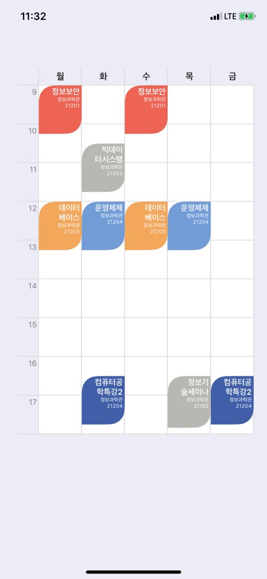

# Elliotable
Elliotable is simple library to generate Timetable of University.   
If you only add a course, the course time is automatically calculated and added to the timetable.   

### Author Information
Timetable Library for iOS Development   
Author : Elliott Kim / Seoul, South Korea   
   
[](http://cocoapods.org/pods/Elliotable)
[](http://cocoapods.org/pods/Elliotable)
[](http://cocoapods.org/pods/Elliotable)
[](http://cocoapods.org/pods/Elliotable)
[](http://cocoapods.org/pods/Elliotable)

## Installation

### Cocoapods
Elliotable is available through CocoaPods, to install it simply add the following line to your Podfile:   
```ruby
pod "Elliotable"
```

## Usage   
### Day Symbol Definition   
```swift
private let daySymbol = ["Mon", "Tue", "Wed", "Thu", "Fri"]   
```
### Item Click Handler Implementaion    
```swift
let handler = { (course: ElliottEvent) in   
    print(course.courseName, course.courseDay)   
}   
```

### Course Item Structure   
```swift
courseId : The identifier of the course   
courseName : The name of the course
roomName : The name of the lecture room
courseDay : Weekday of the course
startTime : Start time of course (String type - format : "HH:mm")
endTime : End time of course (String type - format : "HH:mm")
backgroundColor : backgroud color of each course item
tapHandler : on Touch Event Listener for each course item.
```

### How to use   
First, import my library by adding line below.   
```swift
import Elliotable
```
And then, create courses to add to the timetable.   
```swift
let course_1 = ElliottEvent(courseId: "2150000000", courseName: "Operating System", roomName: "IT Building 21204", courseDay: .tuesday, startTime: "12:00", endTime: "13:15", backgroundColor: [UIColor], tapHandler: handler)

let course_2 = ElliottEvent(courseId: "2150000000", courseName: "Operating System", roomName: "IT Building 21204", courseDay: .thursday, startTime: "12:00", endTime: "13:15", backgroundColor: [UIColor], tapHandler: handler)
```
Finally, define the properties of the timetable.   
```swift
elliotable.courseItems = [course_1, course_2, course_3, course_4, course_5, course_6, course_7, course_8, course_9, course_10]    
// WeekDay Character : e.g) Mon, Tue, Wed, Thu etc.    
elliotable.userDaySymbol = daySymbol    
// The number of daySymbol    
elliotable.dayCount = daySymbol.count    
// Background Color of Elliotable    
elliotable.backgroundColor = .white    
// Elliotable Border Width    
elliotable.borderWidth = 1    
// Elliotable Border Color    
elliotable.borderColor = UIColor(red: 0.85, green: 0.85, blue: 0.85, alpha: 1.0)    
// Course Item Round Option    
elliotable.hasRoundCorner = true    
// Course Item Round Radius    
elliotable.borderCornerRadius = 24    
// Text Inset of Course Item    
elliotable.textEdgeInsets = UIEdgeInsets(top: 3, left: 3, bottom: 3, right: 3)    
// Max Length of Course Name length    
elliotable.maximumNameLength = 18    
// Course Item Text Alignment    
elliotable.textAlignment = .right    
// Course Item Text Vertical Alignment    
elliotable.isTextVerticalCenter = false    
// Course Name Font Size    
elliotable.textFontSize = 12.5    
// Course Lecture Room Font Size    
elliotable.roomNameFontSize = 8   
// WeekDay Font Size    
elliotable.symbolFontSize = 14    
// Left Time Section Font Size    
elliotable.symbolTimeFontSize = 14    
// WeekDay Font Color    
elliotable.symbolFontColor = UIColor(displayP3Red: 0.1, green: 0.1, blue: 0.1, alpha: 1.0)    
// Left Time Section Font Color 
elliotable.symbolTimeFontColor = UIColor(displayP3Red: 0.1, green: 0.1, blue: 0.1, alpha: 1.0)    
// Background Color of WeekDay Section and Left Time Section    
elliotable.symbolBackgroundColor = UIColor(displayP3Red: 0.95, green: 0.95, blue: 0.95, alpha: 1.0)    
```

On your storyboard, just add a "View" Component.     
On the Inspector Frame, choose the View class to "Elliotable"   

### Screenshot   
{: width="50%" height="50%"} {: width="50%" height="50%"}   
