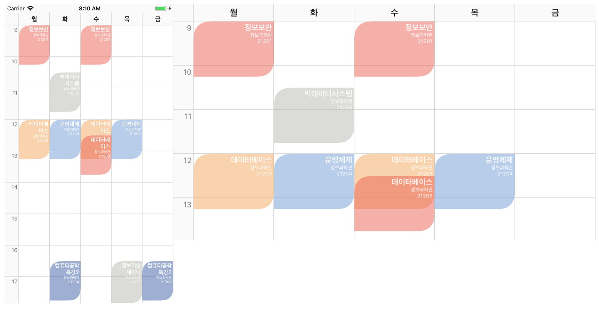

# Elliotable
Elliotable은 간단하게 대한민국 대학교 시간표를 누구나 손쉽게 구현할 수 있도록 만들어진 라이브러리입니다.   
개발자분들은 강의만 추가해주시면 기본적인 시간표를 만들 수 있으며 제공되는 다양한 옵션들을 통해 커스텀화할 수 있습니다.   
본 라이브러리는 **시간표의 시작 시각과 종료 시각을 자동으로 계산**하여 적용합니다.  
강의 아이템을 추가하면 **가장 빠른 시간**과 **가장 늦은 시간**을 계산하여 시간표를 구성해줍니다.  

XCode 12 Beta 대응을 위하여 빌드를 하였고 성공하였습니다!!  

### What's New in v1.2.5   
- 교수 이름 추가    

### 개발자 정보
iOS 개발을 위한 시간표 라이브러리   
개발자 : 김태인 (Denny.K) / 서울, 대한민국   
이메일 : della.kimko@gmail.com   
블로그 : https://terry-some.tistory.com/  
최신 버전 : 1.2.5 (Cocoapods)    
  
[](http://cocoapods.org/pods/Elliotable)
[](http://cocoapods.org/pods/Elliotable)
[](http://cocoapods.org/pods/Elliotable)
[](http://cocoapods.org/pods/Elliotable)
[](http://cocoapods.org/pods/Elliotable)

## 스크린샷   
#### 세로 화면 및 가로 화면 시간표      
   

## 설치 방법

### Cocoapods
Elliotable은 Cocoapods을 통해 배포되었습니다. Podfile에 다음을 추가 한 후 pod install 을 통해 라이브러리를 적용할 수 있습니다. :   
```ruby
pod 'Elliotable'
```

## 라이브러리 사용    
   
### 강의 아이템 구조   
```swift
courseId : 강의 고유번호(ID)   
courseName : 강의 이름 
roomName : 강의실 이름(예 : 정보과학관 21101)
professor: 교수 이름  
courseDay : 요일
startTime : 강의 시작 시간(형식 - "HH:mm")
endTime : 강의 종료 시간(형식 - "HH:mm")
backgroundColor : 강의 아이템 배경 색상
(Optional) textColor: 강의 아이템 글씨 색상 (선택적으로 적용 가능한 옵션)
```

### 사용 방법    
스토리보드에서 "View"를 추가합니다.    
Inspector 창에서 추가한 View의 class를 "Elliotable"로 선택합니다.   
   
다음 사진은 view를 swift파일에 바인딩하는 것을 보여주는 스크린샷입니다.   
   


우선 import를 합니다.   
```swift
import Elliotable
```
시간표 강의 아이템들을 원하는 만큼 추가해줍니다.   
```swift
let course_1 = ElliottEvent(courseId: "c0001", courseName: "Operating System", roomName: "IT Building 21204", professor: "TEST", courseDay: .tuesday, startTime: "12:00", endTime: "13:15", backgroundColor: [UIColor])

let course_2 = ElliottEvent(courseId: "c0002", courseName: "Operating System", roomName: "IT Building 21204", professor: "TEST", courseDay: .thursday, startTime: "12:00", endTime: "13:15", textColor: UIColor.white, backgroundColor: [UIColor])
```
아울렛 변수를 선언해줍니다.   
```swift
@IBOutlet var elliotable: Elliotable!
```
## Delegate Pattern  
Elliotable는 Delegate Pattern을 사용합니다.  
```swift
class ViewController : UIViewController, ElliotableDelegate, ElliotableDataSource {

}
```
```swift
// Delegate Pattern  
elliotable.delegate = self  
elliotable.dataSource = self
```  
## 강의 아이템 적용   
강의 아이템을 시간표에 적용하려면 Delegate Pattern 메소드를 활용하여 적용할 수 있습니다. 아래와 같이 말이죠.  
```swift
// Set course Items
func courseItems(in elliotable: Elliotable) -> [ElliottEvent] {  
    return courseList  
}  
```  
## 강의 아이템 변경(업데이트)   
강의 아이템 리스트가 변경될 경우 (추가, 삭제, 변경 등) reloadData() 함수를 반드시 호출해주어야 시간표가 갱신됩니다.  
```swift
elliotable.reloadData()  
```
  
## 강의 아이템 터치 이벤트 처리   
두 가지 터치 이벤트가 있습니다. (일반 터치 이벤트, 롱 터치 이벤트) Delegate Method를 사용하여 터치 이벤트를 처리할 수 있습니다.  
```swift
// Course Tap Event  
func elliotable(elliotable: Elliotable, didSelectCourse selectedCourse: ElliottEvent) { }  

// Course Long Press Event  
func elliotable(elliotable: Elliotable, didLongSelectCourse longSelectedCourse : ElliottEvent) { }  
```
## 강의 아이템 라운드 코너링 처리   
Elliotable은 4가지 라운드 처리를 지원합니다. 스크린샷을 참고하여 적용하시기 바랍니다.  
```swift
// Course Item Round Option : .none, .all, .left(topLeft, bottomRight), .right(topRight, bottomLeft)
elliotable.roundCorner   = .none
```
 
  
## 요일 텍스트 정의   
```swift
private let daySymbol = ["Mon", "Tue", "Wed", "Thu", "Fri"]   
```  
  
## 요일 부분 설정  
요일 텍스트는 DataSource Delegate Method 중 elliotable(elliotable:, at textPerIndex:) 함수와 numberOfDays(in elliotable:) 함수를 사용하여 적용할 수 있습니다.  
```swift
func elliotable(elliotable: Elliotable, at textPerIndex: Int) -> String {  
    return self.daySymbol[textPerIndex]  
}  
  
func numberOfDays(in elliotable: Elliotable) -> Int {  
    return self.daySymbol.count  
}  
```  
  
## 시간표 전체 테두리 설정  
시간표 전체 부분에 대하여 테두리 유무를 설정할 수 있습니다. 스크린 샷을 참고하여 적용하시기 바랍니다.  
```swift
// Full Border Option
elliotable.isFullBorder = true
```
 

기타 시간표 속성들  
```swift   
// Table Item Properties
elliotable.elliotBackgroundColor = UIColor.white
elliotable.borderWidth        = 1
elliotable.borderColor        = UIColor(red: 0.85, green: 0.85, blue: 0.85, alpha: 1.0)

// Course Item Properties
elliotable.textEdgeInsets = UIEdgeInsets(top: 2, left: 3, bottom: 2, right: 10)
elliotable.courseItemMaxNameLength = 18
elliotable.courseItemTextSize      = 12.5
elliotable.courseTextAlignment     = .left
// 시간표 강의 아이템 라운드 
elliotable.borderCornerRadius = 24
elliotable.roomNameFontSize        = 8

// courseItemHeight - default : 60.0
elliottable.courseItemHeight       = 70.0

// Day Symbol & Leftside Time Symbol Properties
elliotable.symbolFontSize = 14
elliotable.symbolTimeFontSize = 12
elliotable.symbolFontColor = UIColor(displayP3Red: 0.1, green: 0.1, blue: 0.1, alpha: 1.0)
elliotable.symbolTimeFontColor = UIColor(displayP3Red: 0.5, green: 0.5, blue: 0.5, alpha: 1.0)
elliotable.symbolBackgroundColor = UIColor(named: "main_bg") ?? .white  
```

